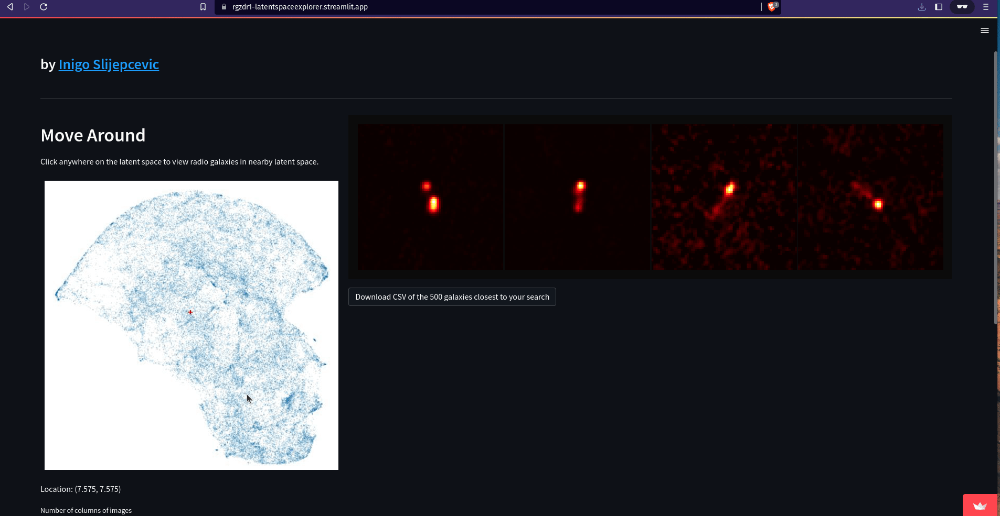
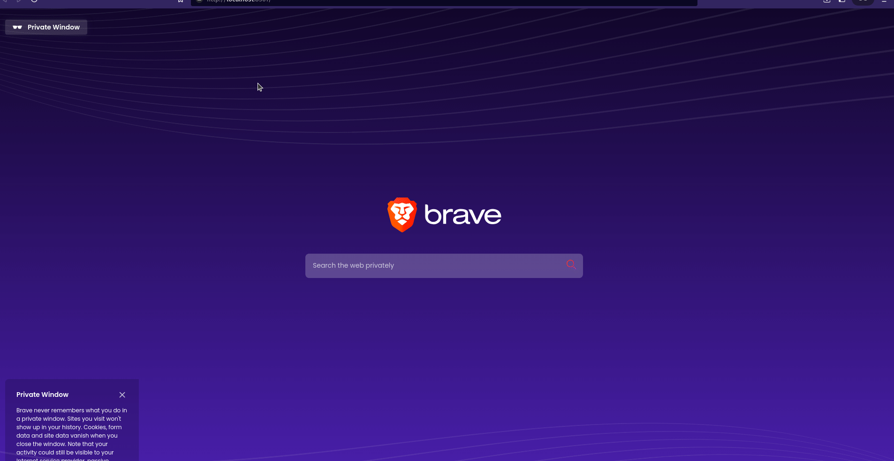

This repo contains two streamlit apps for exploring the latent space of ResNet-18 model trained using the RGZ-DR1 radio galaxy data-set.

# Instructions for use
- Clone this repo.
- Create a new venv for python 3.6+. 
- Activate your virtual environment.
- Install packages by running `pip install -r requirements.txt` (make sure you are in the root of the project).
- Download the files from [this link](https://www.dropbox.com/scl/fo/bts47gvt1pzir282b2tux/h?dl=0&rlkey=l716x8cgklnqqamlnv8yyjo2c) and place in the root folder of this project.
- Use the command `streamlit run main_explorelatent.py` or `streamlit run main_simsearch.py` to run the desired app.

# Latent space explorer
- Allows the user to explore the embedding space of the model visually.
- User clicks on the latent space, specifying a co-ordinate in the embedding space of the model. 
- Nearest neighbours from the RGZ-DR1 dataset will be returned with `.csv` available for download. 
- The script for this app is contained in `main_simsearch`.

# Similarity search
- Allows the user to query the model with a data point of their choice.
- User inputs sky co-ordinates (RA+DEC) which will query SkyView to receive a cutout. 
- The image will be pre-processed and embedded by the model. 
- The nearest neighbours from the RGZ-DR1 dataset in the representation space of the model will be returned with `.csv` available for download. 
- The script for this app is contained in `main_simsearch`.

